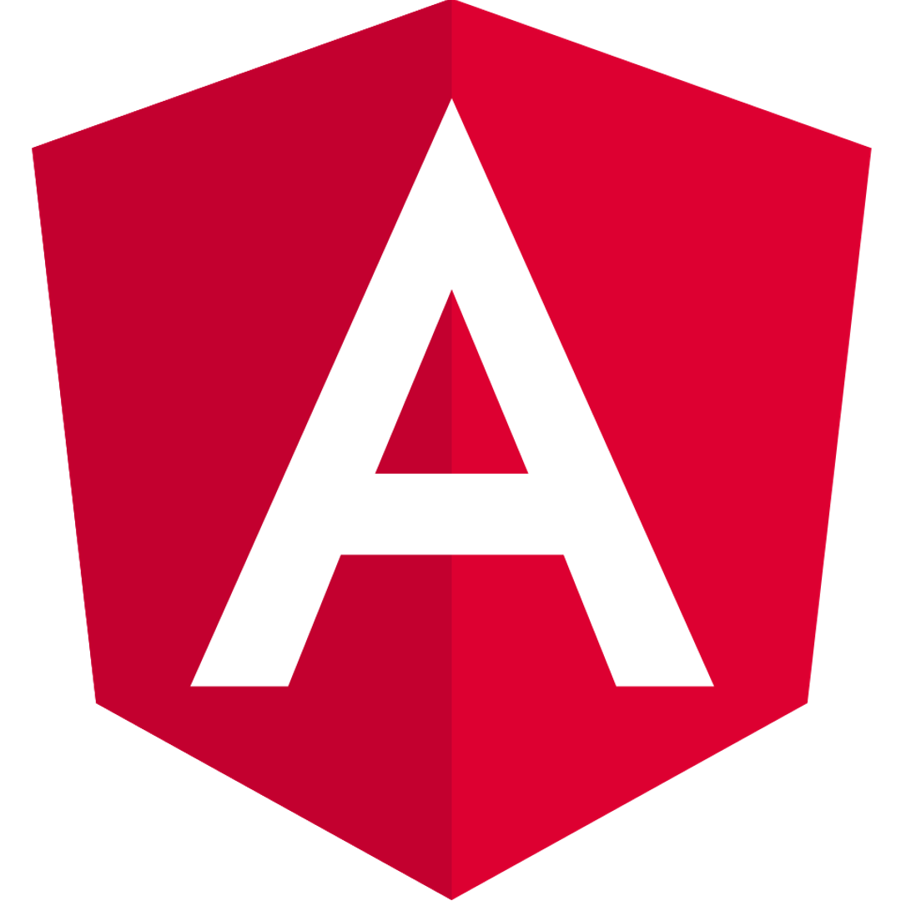
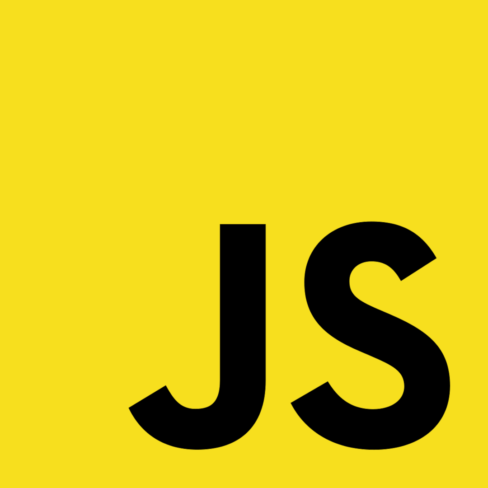
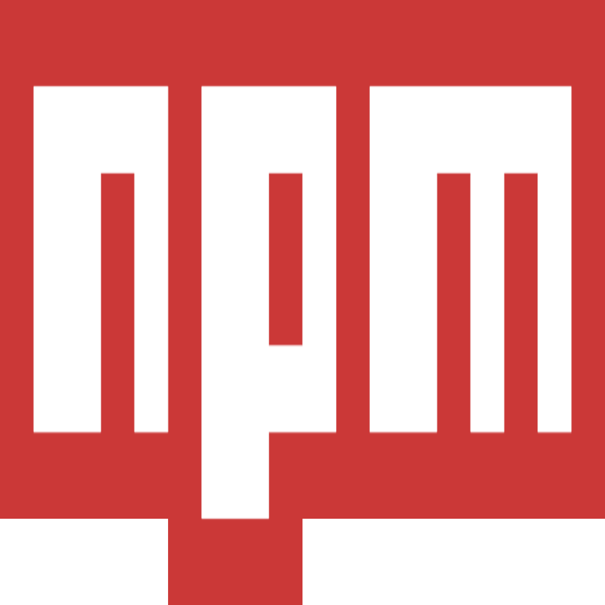

<h1 align="center">Hi 👋, I'm Bartek</h1>
<h2 align="center">👨🏻‍💻 Junior Front-End developer who constantly improves his skills</h2>

<h3><strong>💁🏻‍♂️ About Me:</strong></h3>
I am 24 years old engineer who graduated from the Faculty of Electrical and Computer Engineering at the Rzeszów University of Technology. All the projects I have created are available on my 
<a href="https://bartlomiejsocha.pl">PORTFOLIO.<a>
The main technologies that I have become familiar with are React and Angular. If you are interested in working with me, please check my
<a href="./Images/CV_BartlomiejSocha.pdf" download>RESUME.<a>

 

<h2 align="center" style="font-size: 40px;"><strong>💻 FRONT-END STACK:</strong></h2>

   &nbsp;&nbsp;&nbsp;&nbsp;
   &nbsp;&nbsp;&nbsp;&nbsp;
   &nbsp;&nbsp;&nbsp;&nbsp;
   &nbsp;&nbsp;&nbsp;&nbsp;
   &nbsp;&nbsp;&nbsp;&nbsp;
   &nbsp;&nbsp;&nbsp;&nbsp;
   &nbsp;&nbsp;&nbsp;&nbsp;

 

<h2 align="center" style="font-size: 40px;"><strong>🛠 TECHNOLOGIES I USE:</strong></h2>

    &nbsp;&nbsp;&nbsp;&nbsp;
    &nbsp;&nbsp;&nbsp;&nbsp;
    &nbsp;&nbsp;&nbsp;&nbsp;
    &nbsp;&nbsp;&nbsp;&nbsp;
    &nbsp;&nbsp;&nbsp;&nbsp;
    &nbsp;&nbsp;&nbsp;&nbsp;
    &nbsp;&nbsp;&nbsp;&nbsp;
    &nbsp;&nbsp;&nbsp;&nbsp;

 

<h2 align="center" style="font-size: 40px;"><strong>📈  LANGUAGES I USE MOST OFTEN:</strong></h2>

 

